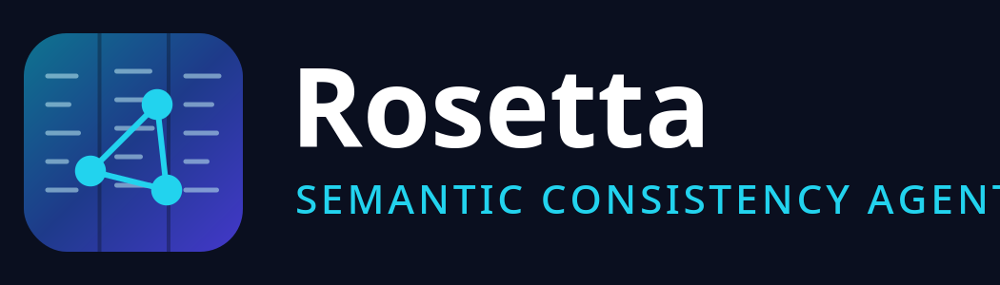
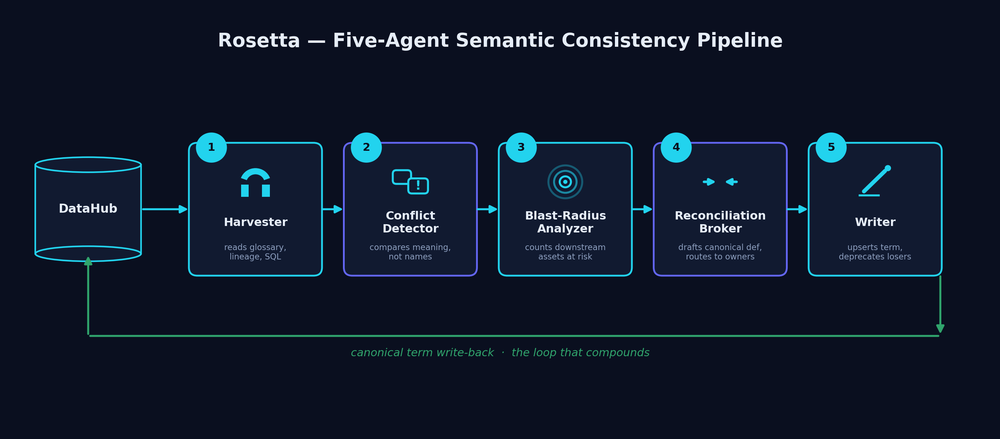
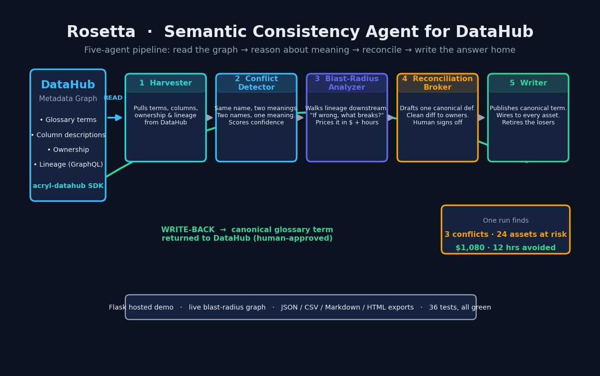
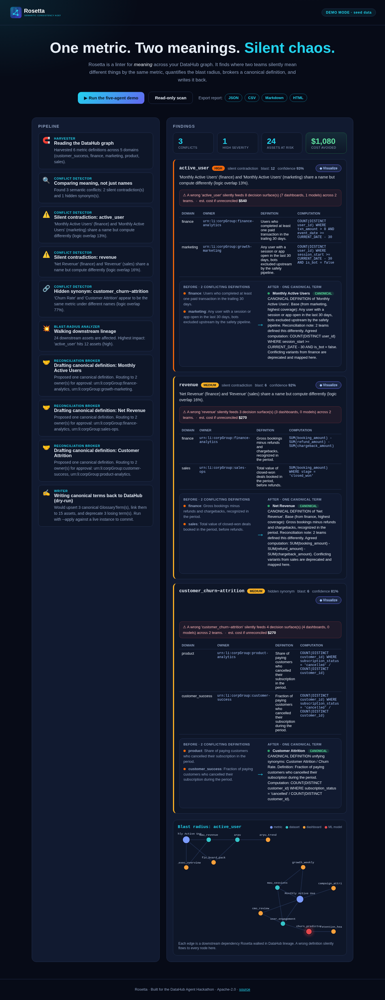

<p align="center">
  
</p>

<h3 align="center">A linter for <em>meaning</em> across your DataHub graph.</h3>

<p align="center">
Rosetta finds where two teams silently mean different things by the same metric,
quantifies the blast radius, brokers a canonical definition, and writes it back into DataHub.
</p>

<p align="center"><b>License:</b> Apache-2.0 · <b>Tests:</b> 36 passing · <b>Built for:</b> Build with DataHub — The Agent Hackathon</p>

---

## The problem
Talk-to-data agents fail **silently** when one metric name has two definitions. Finance's `active_user` (paid transactors) is not marketing's `active_user` (sessions). No dashboard warns you. Rosetta catches it.

## The five-agent pipeline


1. **Harvester** — reads glossary terms, column descriptions, ownership, lineage.
2. **Conflict Detector** — finds *silent contradictions* (same name, different logic) and *hidden synonyms* (different names, same logic) by comparing intent, not text.
3. **Blast-Radius Analyzer** — walks lineage to count downstream assets at risk, scores severity.
4. **Reconciliation Broker** — drafts one canonical definition, routes to the real owners.
5. **Writer** — upserts the canonical GlossaryTerm, links every affected asset, deprecates losers. *The loop that compounds.*


### Full pipeline overview


## Quick start (zero config)
```bash
pip install -r requirements-demo.txt
python webapp/app.py            # open http://localhost:5000  → click "Run the five-agent demo"
# or the terminal walkthrough:
python -m rosetta.orchestrator --demo
```



## CLI
```bash
python -m rosetta.orchestrator --demo                       # narrated offline demo
python -m rosetta.orchestrator --report                     # read-only JSON report
python -m rosetta.orchestrator --report --export all        # write json/csv/md/html to exports/
python -m rosetta.orchestrator --apply                      # write canonical terms back (live)
```

## Live DataHub (optional)
```bash
export DATAHUB_GMS_URL="http://localhost:8080"
export DATAHUB_GMS_TOKEN="<personal access token>"
python -m rosetta.orchestrator --report      # scans your real graph
```
Full instructions, MCP Server setup and how to get a DataHub instance: **[docs/SETUP.md](docs/SETUP.md)**.

## Deploy the hosted demo
Replit (`.replit`), Render (`render.yaml`), Docker (`Dockerfile`) or `gunicorn --chdir webapp app:app`. See docs/SETUP.md.

## Tests
```bash
pytest -q      # 36 passed
```

## Docs
- [SETUP.md](docs/SETUP.md) — install, DataHub account, MCP, live mode
- [SUBMISSION.md](docs/SUBMISSION.md) — copy/paste Devpost description
- [DEMO_SCRIPT.md](docs/DEMO_SCRIPT.md) / [DEMO_RECORDING_GUIDE.md](docs/DEMO_RECORDING_GUIDE.md) — the <3 min video
- [SUBMISSION_CHECKLIST.md](docs/SUBMISSION_CHECKLIST.md) — everything Devpost requires
- [PROJECT_STRUCTURE.md](docs/PROJECT_STRUCTURE.md) — repo map

## Bonus OSS
[`skills/detect-semantic-conflicts.md`](skills/detect-semantic-conflicts.md) — a reusable DataHub Skill.

---
*Rosetta doesn't just answer questions. It makes sure your whole company is asking the same one.*
