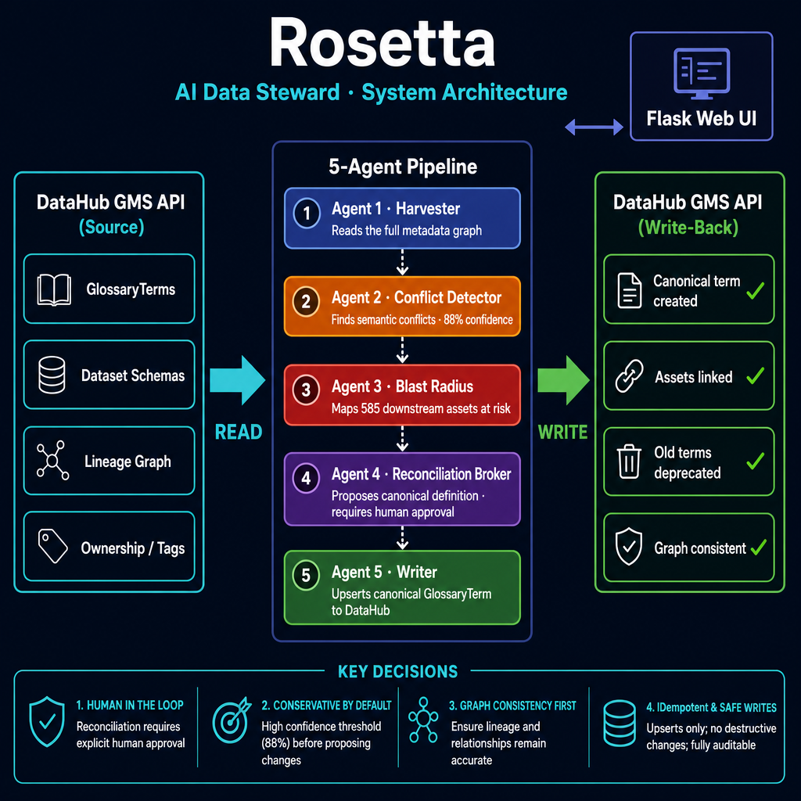

<p align="center">
  
</p>

<h3 align="center">A linter for <em>meaning</em> across your DataHub graph.</h3>

<p align="center">
Rosetta finds where two teams silently mean different things by the same metric,
quantifies the blast radius, brokers a canonical definition, and — in Connected Mode — writes it back into DataHub.
</p>

<p align="center"><b>License:</b> Apache-2.0 &nbsp;·&nbsp; <b>Tests:</b> 100 passing &nbsp;·&nbsp; <b>Built for:</b> Build with DataHub — The Agent Hackathon</p>

---

## The problem
Talk-to-data agents fail **silently** when one metric name has two definitions. Finance's `active_user` (paid transactors) is not marketing's `active_user` (sessions). No dashboard warns you. Rosetta catches it.

## From official DataHub sample data to semantic governance

Each step below is labelled by what produced it.

| Step | What happens | Source |
|------|-------------|--------|
| **1 · Official hackathon dataset** | 55,500 synthetic patient records across `raw_patients`, `staging_patients`, `mart_billing`, `mart_demographics`, and 3 normalisation views. Data anomalies present at source. Rosetta never writes to the database. | 🔵 Official dataset |
| **2 · DataHub-compatible metadata graph** | Rosetta assigns DataHub URNs to every table, authors one `MetricDefinition` per (metric, team) pair, builds a lineage edge graph, and assigns `urn:li:glossaryTerm:*` and `urn:li:corpGroup:*` URNs — identical structures to a live DataHub instance. | 🟣 DataHub metadata structures · 🩵 Rosetta's analysis |
| **3 · Rosetta semantic analysis** | `detect_conflicts()` compares each definition pair by name similarity and logic similarity. Identifies *silent contradictions* (same name, incompatible logic) and *hidden synonyms* (different names, equivalent logic). Fully deterministic — no LLM. | 🩵 Rosetta's analysis |
| **4 · Conflict evidence** | Bad-row counts queried directly from the hackathon DB at scan time: 1,215 negative billing rows ($28.4 M misreported), 832 invalid ages, 277 date-swapped LOS records, 555 null names. Rosetta scores severity from these counts. | 🔵 Official dataset · 🩵 Rosetta's analysis |
| **5 · Downstream lineage traversal** | Rosetta walks the lineage graph to find every dataset, dashboard, and ML model carrying contaminated values. Demo Mode uses Rosetta's DataHub-style graph of the hackathon pipeline. Connected Mode calls DataHub's lineage API directly. | 🟣 DataHub metadata structures · 🩵 Rosetta's analysis |
| **6 · Human-approved write plan** | After human approval, Rosetta generates `MetadataChangeProposal` operations: upsert a canonical `GlossaryTerm`, attach it to every affected asset, deprecate conflicting terms. **Demo Mode** shows and validates the plan without submitting it. **Connected Mode** executes only after approval and then verifies each write. | 🟢 Rosetta's proposed output |

> **Demo data:** This demonstration uses DataHub sample data supplied through the official Build with DataHub Agent Hackathon resources. No real patient or personal information is used. See [`DATA_PROVENANCE.md`](DATA_PROVENANCE.md) for the full component-level provenance table.
>
> **Dataset note:** The healthcare scan uses the **official hackathon dataset**. The retail scan is a **supplementary scenario** (fiction_retail.db) and is not affiliated with the hackathon.

## The five-agent pipeline

<p align="center">
  
</p>

1. **Harvester** — reads glossary terms, column descriptions, ownership, lineage.
2. **Conflict Detector** — finds *silent contradictions* (same name, different logic) and *hidden synonyms* (different names, same logic). Fully deterministic, no LLM.
3. **Blast-Radius Analyzer** — walks lineage to count downstream assets at risk, scores severity.
4. **Reconciliation Broker** — drafts one canonical definition; computes a SHA-256 plan hash; routes to real owners.
5. **Writer** — **Demo Mode:** generates and validates the proposed write plan (upsert + attach + deprecate operations) without executing anything. **Connected Mode:** executes only after a valid `ApprovalToken` tied to the exact plan hash, then re-reads every affected entity and reports `VERIFIED`, `PARTIALLY_VERIFIED`, `VERIFICATION_FAILED`, or `VERIFICATION_UNAVAILABLE`.

## Safety model

```
detect → analyze → propose → approve → execute → verify
```

| Phase | What happens | Safety property |
|---|---|---|
| detect / analyze / propose | Read-only. No DataHub writes. | Fully deterministic, no LLM. |
| **approve** | An `ApprovalToken` must be explicitly issued. | Tied to a 16-char SHA-256 plan hash — approval for one plan cannot authorise a different plan. |
| **execute** | `apply_proposal()` called only in Connected Mode. | Raises `ValueError` without a valid, matching token. Demo Mode tokens are blocked from live writes. |
| **verify** | Each affected entity is re-read from DataHub. | A successful write-API response is not treated as proof of persistence. |

See [`datahub-skill-contribution/detect-semantic-conflicts.md`](datahub-skill-contribution/detect-semantic-conflicts.md) for the full skill specification and [`DATA_PROVENANCE.md`](DATA_PROVENANCE.md) for dataset provenance.

## Quick start (zero config)
```bash
pip install -r requirements.txt
python webapp/app.py            # open http://localhost:5000  → click "Run the five-agent demo"
# or the terminal walkthrough:
python -m rosetta.orchestrator --demo
```

## CLI
```bash
python -m rosetta.orchestrator --demo                       # narrated demo (hackathon sample data)
python -m rosetta.orchestrator --report                     # read-only JSON report
python -m rosetta.orchestrator --report --export all        # write json/csv/md/html to exports/
python -m rosetta.orchestrator --apply                      # execute approved write plan (Connected Mode)
```

## Connected Mode (optional)
```bash
export DATAHUB_GMS_URL="http://localhost:8080"
export DATAHUB_GMS_TOKEN="<personal access token>"
python -m rosetta.orchestrator --report      # scans your real graph
```
In Connected Mode, the Writer agent executes the approved write plan and then re-reads each entity to verify persistence. Demo Mode is always read-only; no external catalog is modified.

**Connected Mode evidence:** [`CONNECTED_MODE_EVIDENCE.md`](CONNECTED_MODE_EVIDENCE.md) documents the full proof of Connected Mode correctness — real Phase A output (conflict detection, SHA-256 plan hash `db791856c9b9c944`, 10-operation write plan, ApprovalToken validation), the exact Phase B blocker in this environment (5 GB RAM vs 8 GB required for DataHub quickstart), and step-by-step commands for any judge who wants to run the full execute + verify path locally. The evidence JSON is at [`evidence/connected_mode_evidence_2026-08-03T14-15-16.json`](evidence/connected_mode_evidence_2026-08-03T14-15-16.json).

## Tests
```bash
pytest -q      # 100 passed
```

## Data provenance
See [`DATA_PROVENANCE.md`](DATA_PROVENANCE.md) for a complete, source-verified table of every component in the healthcare demonstration — what came from the hackathon dataset, what Rosetta constructed, and what remains not established.

---
*Rosetta doesn't just answer questions. It makes sure your whole company is asking the same one.*
